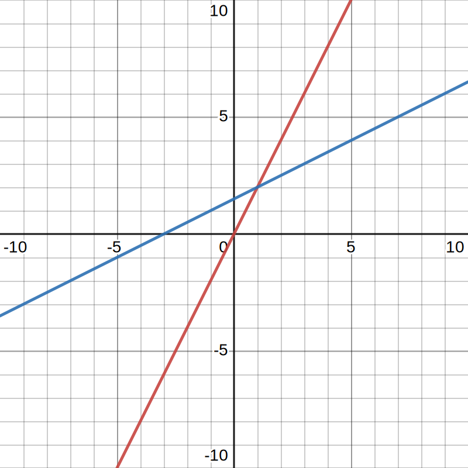
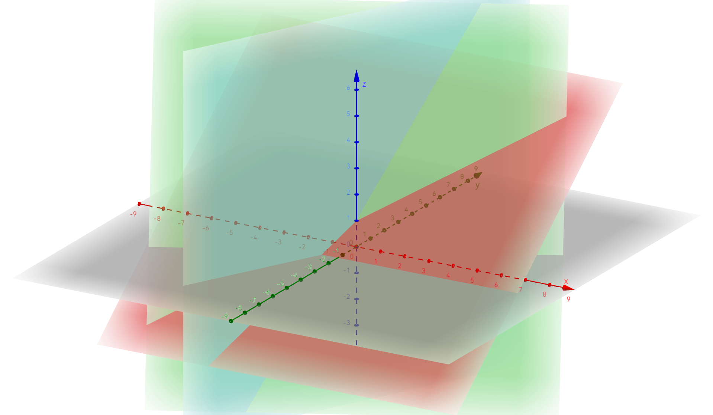

# 1. 方程组的几何解释

> ### 📂 章节目录
>
> ::: details 展开
>
> [[toc]]
>
> :::

事实上，线性方程组和矩阵是**等价**的。接下来，将通过几个例子展现这种等价性。

## 二元一次方程组

首先有以下二元一次方程组：

$$
\begin{aligned}
  2x - y & = 0 \\
  -x + 2y & = 3
\end{aligned}
$$

::: tip 💡 tip

这里讨论的方程组具有 `n` 个未知数、`n` 个方程。

:::

### 与矩阵的转换

将 $x$ 的系数和 $y$ 的系数分别列出，得到以下矩阵：

$$
\begin{bmatrix}
  2 & -1 \\
  -1 & 2
\end{bmatrix}
$$

这种由数组成的矩形阵列，就叫做矩阵。

特殊地，线性方程组的系数提取成的矩阵，就叫做系数矩阵，表示为 $A$。

然后则是两个未知数组成的向量 $
\begin{bmatrix}
  x \\
  y
\end{bmatrix}
$，表示为 $x$。

相乘得到向量 $
\begin{bmatrix}
  0 \\
  3
\end{bmatrix}
$，记作 $b$。

> #### 🧩 和矩阵相关的定义
>
> - 矩阵：一个 $m \times n$ 的矩阵是一个由 $m$ 行（row）$n$ 列（column）元素排列成的矩形阵列
> - 系数矩阵：系数矩阵就是由方程组的系数组成的矩阵
> - 方阵：也称方块矩阵、方矩阵或正方矩阵，是行数及列数皆相同的矩阵

完整的表示如下：

$$
\begin{bmatrix}
  2 & -1 \\
  -1 & 2
\end{bmatrix} \begin{bmatrix}
  x \\
  y
\end{bmatrix} = \begin{bmatrix}
  0 \\
  3
\end{bmatrix}
$$

也就是说线性方程组可以写成 $Ax = b$。

### 几何表示

#### 行图像

一个行图像显示一个方程。行图像遵从解析几何的描述，每个方程在平面坐标系上的图像为一条直线。

$$
\begin{aligned}
  \textcolor{red}{2x - y = 0} \\
  \textcolor{blue}{-x + 2y = 3}
\end{aligned}
$$

两条直线的交点 $(1, 2)$ 即为方程组的解。

#### 列图像

一个列图像显示一个列向量。

将系数矩阵写成列向量的形式，则求解原方程变为寻找列向量的线性组合来构成向量 $b$：

$$
x \begin{bmatrix}
  2 \\
  -1
\end{bmatrix} + y \begin{bmatrix}
  -1 \\
  2
\end{bmatrix} = \begin{bmatrix}
  0 \\
  3
\end{bmatrix}
$$

::: tip 💡 tip

如果取任意 $x$、$y$，则以上两个向量得到的所有线性组合会铺满整个坐标平面。

:::

## 三元一次方程组

### 与矩阵的转换

接下来让我们来看看三元一次方程组：

$$
\begin{aligned}
  2x - y & = 0 \\
  -x + 2y - z & = -1 \\
  -3y + 4z & = 4
\end{aligned}
$$

将未知数的对齐：

$$
\begin{aligned}
  2x - y + 0z & = 0 \\
  -x + 2y - z & = -1 \\
  0x - 3y + 4z & = 4
\end{aligned}
$$

然后提取出系数：

$$
\begin{bmatrix}
  2 & -1 & 0 \\
  -1 & 2 & -1 \\
  0 & -3 & 4
\end{bmatrix}
$$

就得到了如上的 3×3 的矩阵。

同理，可以将方程组写成如下的形式：

$$
\begin{bmatrix}
  2 & -1 & 0 \\
  -1 & 2 & -1 \\
  0 & -3 & 4
\end{bmatrix} \begin{bmatrix}
  x \\
  y \\
  z
\end{bmatrix} = \begin{bmatrix}
  0 \\
  -1 \\
  4
\end{bmatrix}
$$

### 几何表示

#### 行图像

由于现在有三个未知数，故图像在三维坐标系中。每个方程在三维空间中实际上是一个平面。

$$
\begin{aligned}
  \textcolor{blue}{2x - y = 0} \\
  \textcolor{green}{-x + 2y - z = -1} \\
  \textcolor{red}{-3y + 4z = 4}
\end{aligned}
$$

三个平面的交点 $(0, 0, 1)$ 即为方程组的解。

::: tip 💡 tip

可以使用在线工具 [GeoGebra 3D 计算器](https://www.geogebra.org/3d) 绘图，更加直观地感受其几何意义。

:::

#### 列图像

类似地，可以表示为：

$$
x \begin{bmatrix}
  2 \\
  -1 \\
  0
\end{bmatrix} + y \begin{bmatrix}
  -1 \\
  2 \\
  -3
\end{bmatrix} + z \begin{bmatrix}
  0 \\
  -1 \\
  4
\end{bmatrix} = \begin{bmatrix}
  0 \\
  -1 \\
  4
\end{bmatrix}
$$

## 矩阵与向量的乘法

实际上，在前述部分我们已经使用到了矩阵与向量的乘法。这里是更加详细的描述。

### 方法 1：线性组合

$Ax$ 是矩阵 $A$ 列向量的线性组合：

$$
\begin{bmatrix}
  2 & -1 \\
  -1 & 2
\end{bmatrix} \begin{bmatrix}
  1 \\
  2
\end{bmatrix} = 1 \begin{bmatrix}
  2 \\
  -1
\end{bmatrix} + 2 \begin{bmatrix}
  -1 \\
  2
\end{bmatrix} = \begin{bmatrix}
  2 \\
  -1
\end{bmatrix} + \begin{bmatrix}
  -2 \\
  4
\end{bmatrix} = \begin{bmatrix}
  0 \\
  3
\end{bmatrix}
$$

### 方式 2：点积

方式 2 本质上和方式 1 是一样的。

$$
\begin{bmatrix}
  2 & -1 \\
  -1 & 2
\end{bmatrix} \begin{bmatrix}
  1 \\
  2
\end{bmatrix} = \begin{bmatrix}
  2 × 1 + -1 × 2 \\
  -1 × 1 + 2 × 2
\end{bmatrix} = \begin{bmatrix}
  0 \\
  3
\end{bmatrix}
$$
