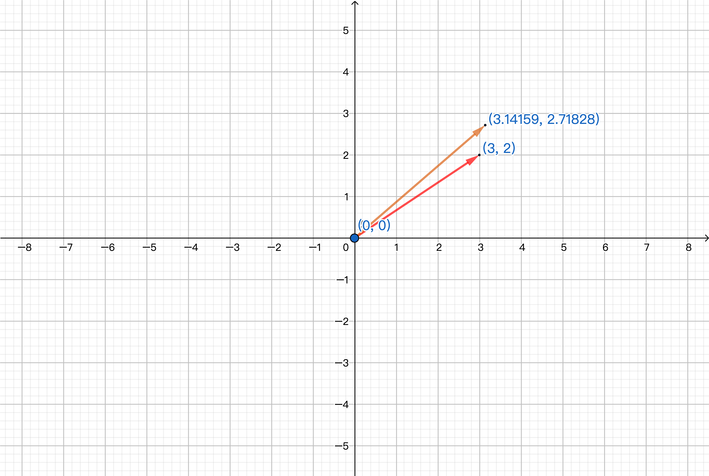

# 5. 转置、置换、向量空间

> ### 📂 章节目录
>
> ::: details 展开
>
> [[toc]]
>
> :::

## 置换

温故而知新，首先重新复习一下之前几节关于置换的知识点。

置换矩阵是行重新排列了的单位矩阵。在应用消元法的过程中，如果碰巧遇到 $0$ 出现在主元的位置上就需要通过左乘置换矩阵进行行交换将 $0$ 移走。而一些程序如 MATLAB 为了满足数值计算的要求，不仅会检验主元位置是否为 $0$，还会对非常小的非零主元也进行行交换。

理论上可以进行两次、甚至更多次行互换，但是为了完成上一小节的理论，或者说不增加额外的工作量，将矩阵的 LU 分解从 $A = LU$ 变为 $PA = LU$（$P$ 就是对 $A$ 的行向量进行重新排列的置换矩阵，它将各行互换为正确的顺序，互换后所有主元位置将不再会出现 $0$）。

::: tip 💡 tip

此处的 $P$ 的效果可以将 $A$ 变为一个在消元过程中自始自终完全不需要行交换的矩阵。

:::

对于 $n \times n$ 矩阵存在着 $n!$ 个置换矩阵。置换矩阵具有 $P^{-1} = P^{T}$ 也就是 $P^{T}P = I$ 的性质。

我们对转置乘以自身等于单位矩阵的矩阵很感兴趣，而置换矩阵刚好具有这种性质。

## 转置

在之前的小节中已经介绍了转置的定义，故此不再赘述。

转置矩阵记作 $T$，例如：

$$
R^{T} = \begin{bmatrix}
  \textcolor{red}{1} & 3 \\
  2 & \textcolor{red}{3} \\
  4 & 1
\end{bmatrix}^{T} = \begin{bmatrix}
  \textcolor{red}{1} & 2 & 4 \\
  3 & \textcolor{red}{3} & 1
\end{bmatrix} = R
$$

其中，若 $A$ 是对称矩阵，则：

$$
A^{T} = A
$$

> #### 🧩 对称矩阵的定义
>
> 对称矩阵（symmetric matrix）指转置矩阵和自身相等的方形矩阵。

对称矩阵的转置和它自身相等的情况比之前提到的矩阵的转置和它自身的逆相等的情况要更加常见。

矩阵乘积的转置也在上一小节中介绍了：

$$
\left( AB \right) ^{T} = B^{T}A^{T}
$$

给定一个可以不是方阵的矩阵 $R$，可以通过它的转置 $R^{T}$ 和它自身相乘得到对称矩阵，也就是说 $R^{T}R$ 一定是对称矩阵。例如：

$$
R^{T}R = \begin{bmatrix}
  \textcolor{red}{1} & 3 \\
  2 & \textcolor{red}{3} \\
  4 & 1
\end{bmatrix}^{T} \begin{bmatrix}
  \textcolor{red}{1} & 2 & 4 \\
  3 & \textcolor{red}{3} & 1
\end{bmatrix} = \begin{bmatrix}
  10 & \textcolor{red}{11} & \textcolor{green}{7} \\
  \textcolor{red}{11} & 13 & \textcolor{blue}{11} \\
  \textcolor{green}{7} & \textcolor{blue}{11} & 17
\end{bmatrix}
$$

使用矩阵语言的证明也很简单，只需要对它们的乘积转置即可：

$$
\left( R^{T}R \right) ^{T} = R^{T} \left( R^{T} \right) ^{T} = R^{T}R
$$

## 向量空间

下面将进入向量空间的讨论。

我们可以对向量进行线性运算 —— 加法（如 $v + w$）和数乘（如 $3v$），通过这两种运算得到向量的线性组合。

向量空间中的“空间”表示有一整个空间的向量，但并不是任意向量的组合 —— 向量空间必须满足一定的规则。

> #### 🧩 向量空间必须满足的规则
>
> 向量空间对线性运算封闭，即空间内向量进行线性运算得到的向量仍在空间之内。

以向量空间 $R^{2}$ 为例，它表示具有两个实数分量的所有向量（二维实向量）的集合，例如 $\begin{bmatrix}
  3 \\
  2
\end{bmatrix}$、$\begin{bmatrix}
  0 \\
  0
\end{bmatrix}$、$\begin{bmatrix}
  \pi \\
  e
\end{bmatrix}$ 等等。

向量 $\begin{bmatrix}
  a \\
  b
\end{bmatrix}$ 的图像是从原点到 $\left( a ,b \right)$ 的箭头，向量空间 $R^{2}$ 的图像即为整个 $x$ - $y$ 平面：

假设将 $\begin{bmatrix}
  0 \\
  0
\end{bmatrix}$ 去掉，这就像在 $x$ - $y$ 平面扎了一个洞，这将使得其不再构成向量空间 —— 因为向量空间中的任何向量数乘 $0$ 或者加上其反向量都会得到零向量，而向量空间对线性运算封闭，故**零向量必然属于向量空间**。

类似的，$R^{3}$ 表示具有三个实数分量的所有向量（三维实向量）的集合；$R^{n}$ 表示具有 $n$ 个实数分量的所有向量（$n$ 维实向量）的集合。

除了上面去掉零向量的例子之外，$R^{2}$ 的第一象限也不构成向量空间。

$R^{2}$ 的第一象限中的所有向量都具有非负的性质，对于相加操作来说是安全的，相加所得的向量依然在第一象限中；但是对于数乘操作来说，结果就有问题了，例如将某个向量乘以一个负数，所得的向量就到第三象限去了。因此第一象限不构成向量空间，它不是“封闭”的。

### 子空间

### 列空间
